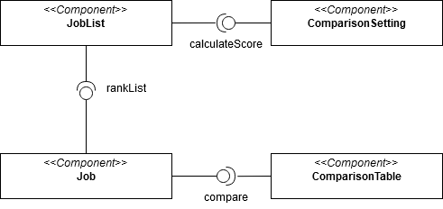
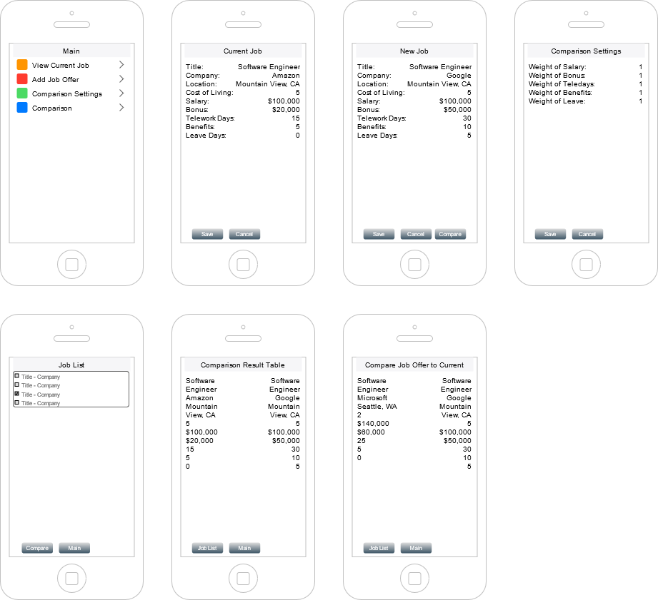

# Design Document

*This is the template for your design document. The parts in italics are concise explanations of what should go in the corresponding sections and should not appear in the final document.*

**Author**: Jon Murphy, 

## 1 Design Considerations

*The subsections below describe the issues that need to be addressed or resolved prior to or while completing the design, as well as issues that may influence the design process.*

### 1.1 Assumptions

*Describe any assumption, background, or dependencies of the software, its use, the operational environment, or significant project issues.*

The minimum API level for the application will be API 28: Android 9.0. The system will rely on a ContentProvider (SQLite database) to store job details. It will require no login process. The operational environment will consist of a GUI and several interactive screens. 

### 1.2 Constraints

*Describe any constraints on the system that have a significant impact on the design of the system.*

As discussed in the assumptions above, the minimum API level for the application will be API 28: Android 9.0 and the application will require the use of a SQLite database. Both of these constraints may impact the design of the application.
### 1.3 System Environment

*Describe the hardware and software that the system must operate in and interact with.*

The system will run on Android OS version 9.0 and should run on Android devices that support this OS version.  

## 2 Architectural Design

*The architecture provides the high-level design view of a system and provides a basis for more detailed design work. These subsections describe the top-level components of the system you are building and their relationships.*

### 2.1 Component Diagram

### 2.2 Deployment Diagram
Because the system is deployed to a single system (no communication or saving between devices is necessary)，so 
the deployment diagram will simply be like below:

## 3 Low-Level Design

*Describe the low-level design for each of the system components identified in the previous section. For each component, you should provide details in the following UML diagrams to show its internal structure.*

### 3.1 Class Diagram

### 3.2 Other Diagrams

*<u>Optionally</u>, you can decide to describe some dynamic aspects of your system using one or more behavioral diagrams, such as sequence and state diagrams.*

## 4 User Interface Design

